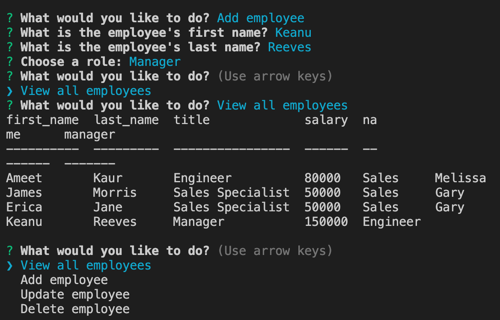

# Employee Tracker

The employee tracker application will keep track of all employees and their role, salary, department, and manager. 

In the application, employers are able to view employees, add employees, update employee roles, and delete employees.

By viewing employees, a table will show all employees and their role, salary, department, and manager.

By adding an employee, employers will be prompted to enter the employees first name, last name, and their role, which will automatically fill the department and salary category.

By updating employee roles, employers will be prompted to choose a new role our of the available roles.

By deleting an employee, employers can remove existing employees with one easy click.

